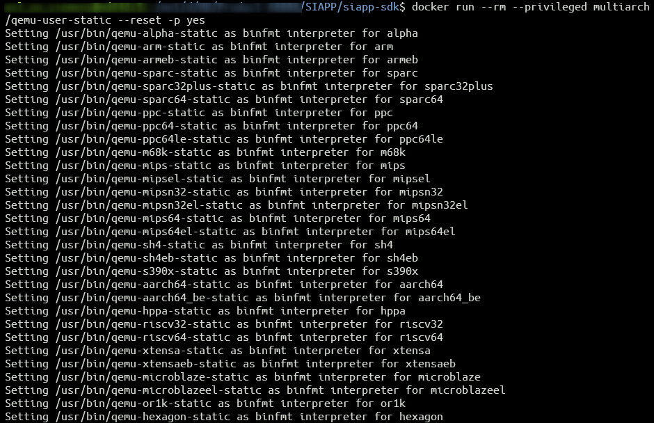
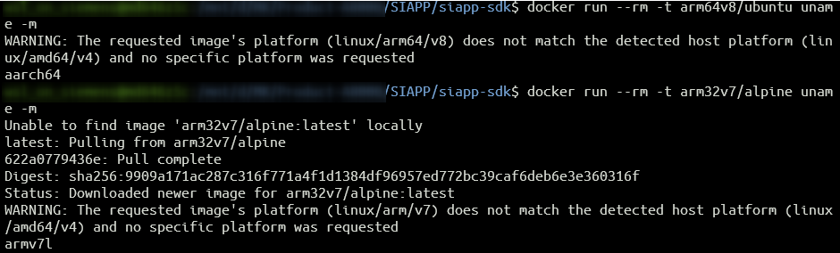

# SIAPP issues
## Unable to build example projects in WSL
- This is due to the fact that docker is running on `x86_64` architecture and the Dockerfile has command `RUN` that executes command before the image is created which assumes the architecture is `arm32v7`.
- [Issue](https://github.com/siemens/siapp-sdk/issues/5) was raised in [siapp-sdk](https://github.com/siemens/siapp-sdk) repo.
The solution is add multi arch support to docker installation ([source](https://github.com/multiarch/qemu-user-static)).
For a docker file that uses different architecture other than host may have to run to run cmd#3 before running the docker script. 
- Commands
    ```
    uname -m
    ```
    ***Output:*** `x86_64`
    ```
    docker run --rm -t arm64v8/ubuntu uname -m
    ```
    ***Output:*** `standard_init_linux.go:228: exec user process caused: exec format error`
    
    The following command allows you to `RUN` docker commands on cross arch platforms 
    ```
    docker run --rm --privileged multiarch/qemu-user-static --reset -p yes
    ```
    
- If **arm64v8/ubuntu** image does not exit then pull else show the `aarch64`
    ```
    docker run --rm -t arm64v8/ubuntu uname -m
    ```
    ***Output:*** `aarch64`
- If **arm32v7/alpine** image does not exit then pull else show the `armv71`
    ```
    docker run --rm -t arm32v7/alpine uname -m
    ```
    ***Output:*** `armv71`
    
