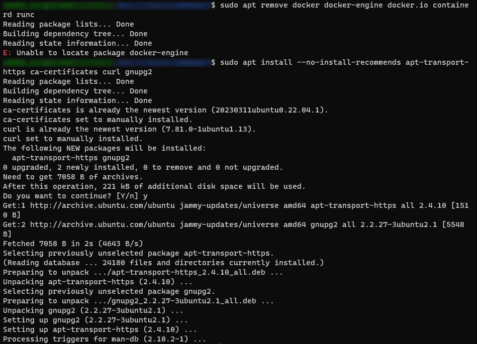
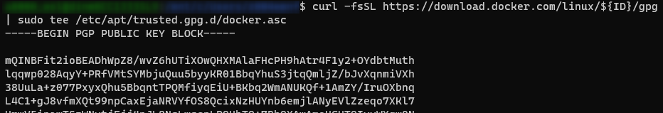
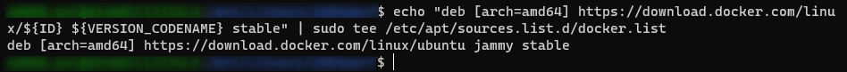
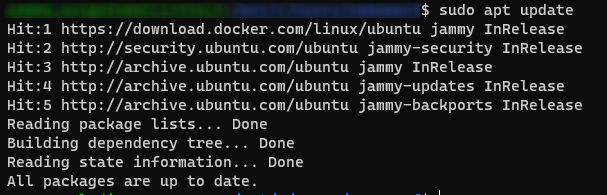
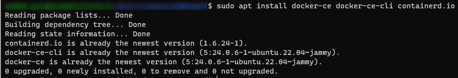
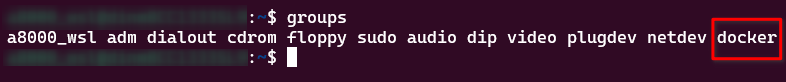
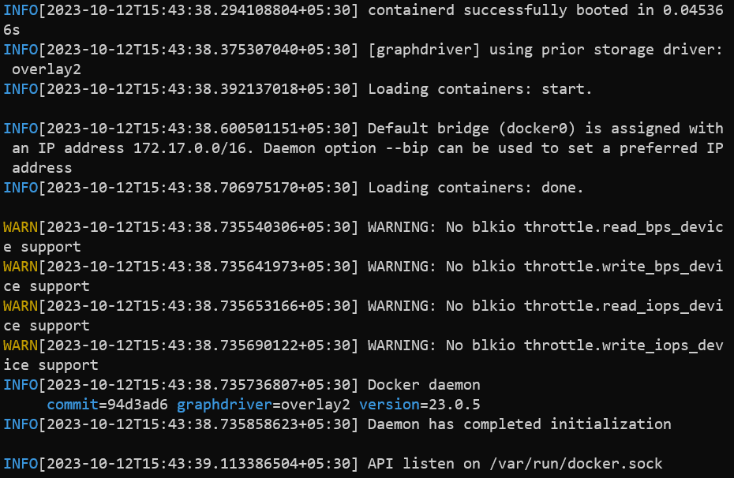
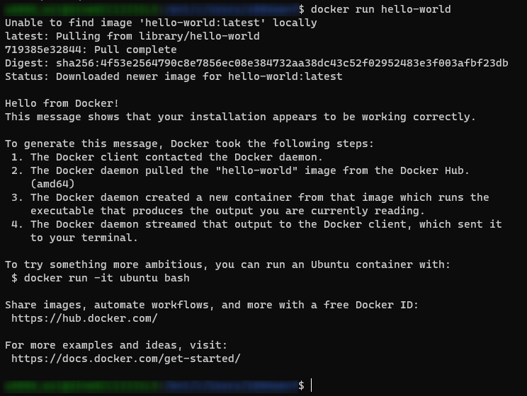

# Setting up Docker in WSL
[source](https://dev.to/bowmanjd/install-docker-on-windows-wsl-without-docker-desktop-34m9)<br>
> **NOTE**:
> 1. Following commands must be executed in ***admin mode power shell***
> 2. Login to WSL from this admin mode power shell.
> 3. For more info on [WSL](https://docs.microsoft.com/en-us/windows/wsl/install-win10)
> 
If you think setting up docker is a single cmd task then you are wrong!... I hope this works for you... : )
- Configure sudo access for the non-root user:
  ```
  grep -E 'sudo|wheel' /etc/group
  ```
- (should get: `sudo:27:myusername` el ose run: `usermod -aG sudo myusername`)
  ```
  sudo grep -E '%sudo|%wheel' /etc/sudoers
  ```
- should get: %wheel ALL=(ALL) ALL else edit and uncomment
  ```
  su myusername
  ```
- should get: no errors
  ```
  sudo -v
  ```

## Update/upgrade packages(test network)
- should get no errors in following command
  ```
  sudo apt update && sudo apt upgrade
  ```
- **else** run below commands
  ```
  echo -e "[network]\ngenerateResolvConf = false" | sudo tee -a /etc/wsl.conf
  ```
  ```
  sudo unlink /etc/resolv.conf
  ```
  ```
  echo nameserver 1.1.1.1 | sudo tee /etc/resolv.conf
  ```
- if the errors persist then try the below commands
  ```
  netsh winsock reset
  ```
  ```
  netsh int ip reset all
  ```
  ```
  netsh winhttp reset proxy
  ```
  ```
  ipconfig /flushdns
  ```
  ```
  reboot
  ```

## Setup docker repo(cli-tools)
- (remove residue)
  ```
  sudo apt remove docker docker-engine docker.io containerd runc
  ```
  ```
  sudo apt install --no-install-recommends apt-transport-https ca-certificates curl gnupg2
  ```
  
- (install dependencies)
  ```
  source /etc/os-release
  ```
  
  ```
  curl -fsSL https://download.docker.com/linux/${ID}/gpg | sudo tee /etc/apt/trusted.gpg.d/docker.asc
  ```
  
- (setup docker repo)
  ```
  echo "deb [arch=amd64] https://download.docker.com/linux/${ID} ${VERSION_CODENAME} stable" | sudo tee /etc/apt/sources.list.d/docker.list
  ```
  
- Add repo to source and run update docker repo(cli-tools) 
  ```
  sudo apt update
  ```
  

##  Install Docker:
- This is where you install docker
  ```
  sudo apt install docker-ce docker-ce-cli containerd.io
  ```
  
- add user to docker group
  ```
  sudo usermod -aG docker $USER
  ```
- logout 
  ```
  exit
  ```
- login to wsl
  ```
  wsl
  ```
  ```
  groups
  ```
  (This list should have **docker**)
  

## Run docker daemon:
> NOTE: You will have to run the powershell in admin mode to run the sudo dockerd command
  ```
  sudo dockerd
  ```
  
  - (should get: `API listen on /var/run/docker.sock` at the end)
- To test the docker open another instance of WSL
  ```
  docker run hello-world
  ```
  

## Issue you may face
- apt update and upgrade not working
  ```
  sudo nano /etc/resolv.conf
  ```
- Change nameserver to following line
  ```
  nameserver 8.8.8.8
  ```
- To make this change permanent create file **_/etc/wsl.conf_** and add following
  ```
  sudo nano /etc/resolv.conf
  ```
  ```
  [network]
  generateResolvConf = false
  ```